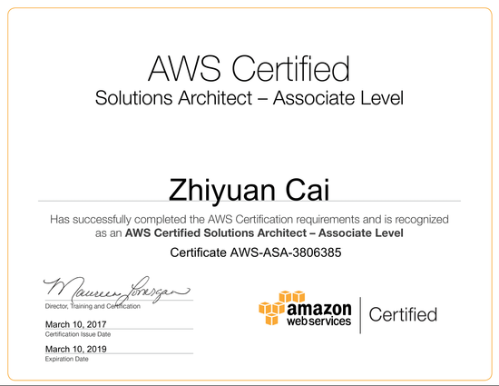

Passed the AWS Certified Solutions Architect (CSA) - Associated Level Exam last Friday.

Overall Score: 74%

Topic Level Scoring:
* 1.0 Designing highly available, cost efficient, fault tolerant, scalable systems : 81%
* 2.0 Implementation/Deployment: 50%
* 3.0 Security: 72%
* 4.0 Troubleshooting: 60%

